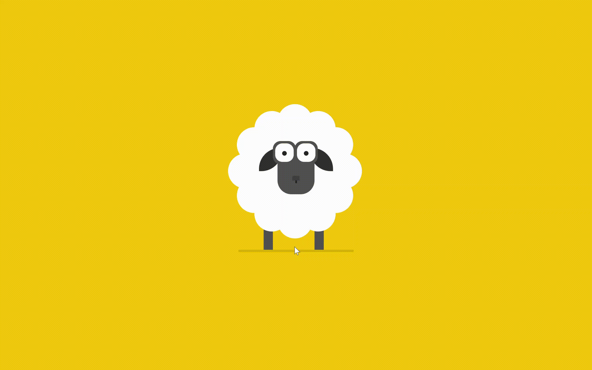

<div align="center" id="top"> 
  

&#xa0;

<a href="https://giankbo.github.io/eye-movement/" target="blank">Demo</a>

</div>

<h1 align="center">Eye Movement</h1>

<p align="center">
  

  

  

  
</p>

<p align="center" markdown="1">
  In this MIT xPRO JavaScript project, the mouse movement event is used to update the position of elements on the page. These elements called 'eyes' simulate the     eye tracking process.
</p>

<p align="center">
   <a href="#writing_hand-features">Features</a>
   ·
   <a href="#checkered_flag-how-to-run">How to run</a>
   ·
   <a href="#factory-roadmap">Roadmap</a>
   ·
   <a href="#handshake-credits">Credits</a>
   ·
   <a href="#memo-license">License</a>
   ·
   <a href="https://github.com/giankbo" target="blank">Author</a>
</p>

<br>

## :writing_hand: Features

- The *eyes* elements update positions,
- The *eyes* elements follow the mouse position on the screen using mouse events,
- *Sheep* illustration with HTML and CSS.

## :checkered_flag: How to run

Before starting, you need to have [Git](https://git-scm.com) and [Visual Studio Code](https://code.visualstudio.com/) installed. Then, clone the repo:

```bash
# Clone this project
$ git clone https://github.com/giankbo/eye-movement
# Access
$ cd eye-movement
```

## :factory: Roadmap

Add *new elements*, and apply other *mouse events*.

## :handshake: Credits

<a href="https://xpro.mit.edu/" target="blank">MIT xPRO</a>\
<a href="https://www.youtube.com/c/CodingArtist" target="blank">Coding Artist, Mitali Jadhavrao</a>

## :memo: License

This project is under license from MIT. For more details, see the [LICENSE](LICENSE.md) file.

&#xa0;

<a href="#top">Back to top</a>
